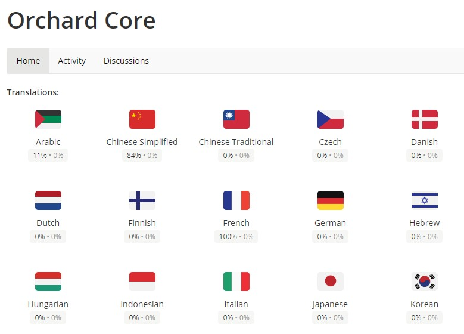
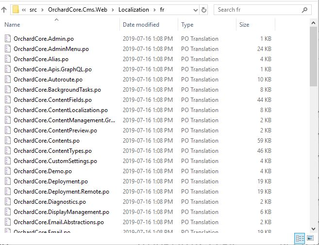

# Installing Localization Files

In this guide you will download and install community managed localization files to localize the Admin of Orchard Core CMS.

## What you will need

- The current version of the .NET Core SDK. You can download it from here [https://www.microsoft.com/net/download/core](https://www.microsoft.com/net/download/core).
- A text editor and a terminal where you can type dotnet commands.
- An already running Orchard Core CMS website. You can follow the guide [Creating an Orchard Core CMS website](../create-cms-application) if you haven't done it yet.

## Downloading the localization files

Localization files are managed by the community on the [Crowdin](https://crowdin.com/project/orchard-core) website. Anyone can provide custom languages or contribute to existing ones.

For this guide we will download the French language.

- Click on __French__, a page with the list of all `.pot` files should appear.
- Click on the __Download or Upload__ button on the top right of the page.
- Select __Download__, a zip file named `fr.zip` will be downloaded by your browser.

## Extracting the localization files

The zip file that you downloaded needs to be extracted in the `Localization` folder of your Orchard Core CMS website.

- Create a folder named `[your_site_root]/Localization` where `your_site_root` is the location of your website.
- Extract the file `fr.zip` in `Localization`

The result should look like this:

## Configuring the supported cultures

By default a new Orchard Core CMS website will only accept the default system culture. This step will configure it to accept French as an alternate language.

- Open the Admin section of Orchard Core CMS by opening the browser on <https://localhost:5001/admin>.
- In the __Configuration__ > __Settings__ > __Cultures__ section, select `fr | French` then click __Add culture__.
- Click on __Save__, the site is reloaded.

## Enabling localization and testing the site

To enable Orchard Core CMS to use these new files, we need to enable the Localization feature.

- In the __Modules__ page search for __Localization__ and click __Enable__. If the feature is already enabled you don't need to do anything.
- In the current url, add `?culture=fr`, the link should look like <https://localhost:44300/blog/OrchardCore.Features/Admin/Features?culture=fr>.

At that point most texts should be displayed in French.  
From now on if a browser is configured with French as its default culture, the Admin will be displayed using the French text translations we downloaded.  
The `?culture=fr` is just one way to simulate that the current request should use French as the UI culture.

## Summary

You just downloaded and enabled a new localization in Orchard Core CMS.
